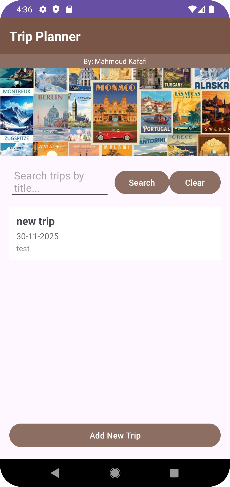
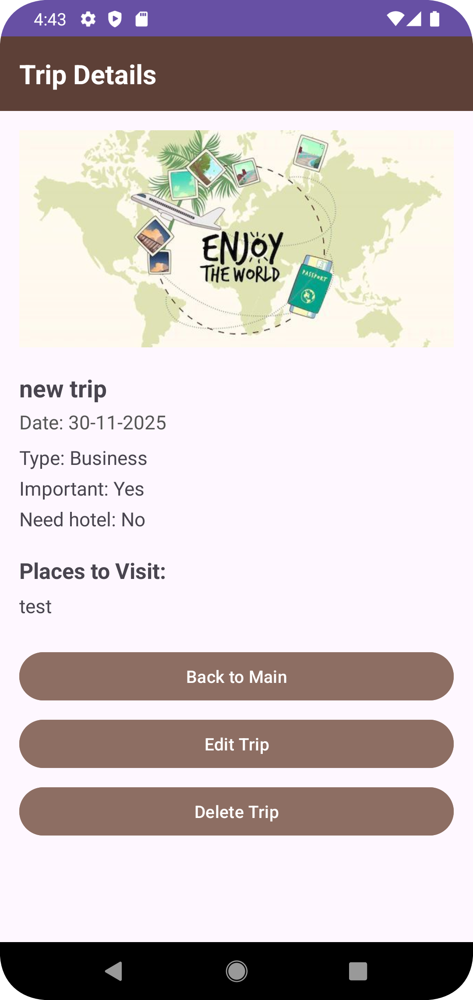
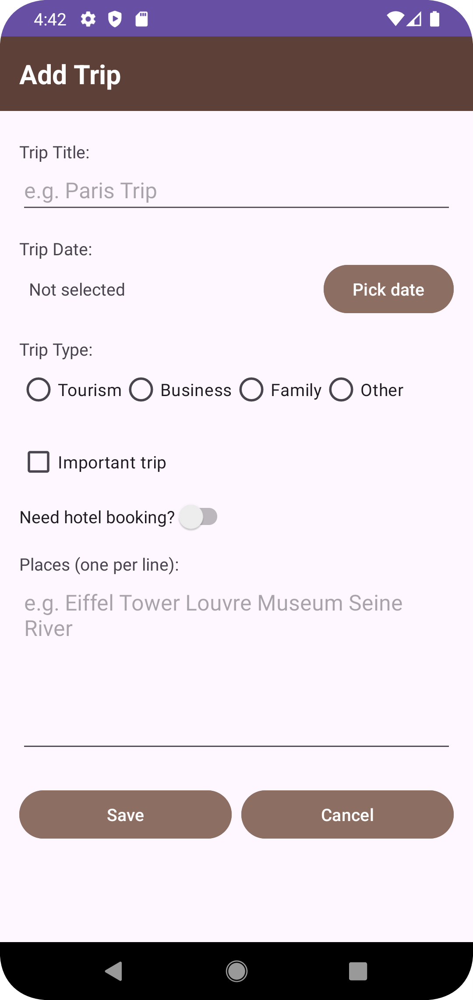

# Trip Planning App
- Name : Mahmoud Kafafi
  
This is my assignment 1  for Mobile App Development course.
The app allows the user to add, edit, search, and delete trips.

## Main Features
- Add new trips
- Edit trip details
- Delete trips
- Search trips by title
- Save data using SharedPreferences
- Date Picker, RadioGroup, CheckBox, Switch
- RecyclerView to show trip list

## Screens for activites in the app

### Main Screen

### Trip Details

### Add / Edit Trip

